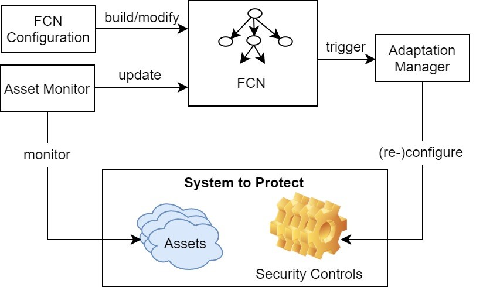

# AssetCentricAdaptiveProtection

Asset Centric Adaptive Protection (ACAP) defines an approach that monitors assets of a system and changes the security controls for those assets in response to changes of assets value. The approach is explained in the paper [Requirements driven Adaptive Security: Protecting Variable Assets at Runtime](https://www.researchgate.net/publication/228533476_Requirements-driven_Adaptive_Security_Protecting_Variable_Assets_at_Runtime). Two prototypes were developed as proofs of concept to demonstrate the ACAP approach: _ACAP Configure tool_ and _ACAP Android app_.

## What is behind the approach
_Fuzzy Causal Network_ (FCN) is used to realise this approach. A FCN of a system captures the relationships among the system’s assets, security and other goals (e.g. usability), threats and their likelihood (e.g. attacks, vulnerability).

ACAP Configuration tool allows users to create, configure, tune a FCN, and compute the utility and the best security configuration of the FCN. The targeted user of the tool is security engineers or security administrators.

ACAP Android app is a practical application of the ACAP approach in Android mobile phones. The app provides security protection to assets, namely your phone and data stored in Apps of your phone. The security protection varies in response to changes of assets value.

## ACAP Reference Architecture

The picture above depicts the reference architecture for ACAP applications. In the picture, FCN Configuration is a component that allows users to build and modify the FCN of a system, which will be stored in the FCN component. Asset Monitor component monitors and interprets assets value of the system to protect. It would update the FCN data if changes of assets value are detected. In response to the changes, FCN component would compute and generate a set of optimal security controls for the FCN. It would then trigger the Adaptation Manager to reconfigure the security controls of the system to the optimal ones.
